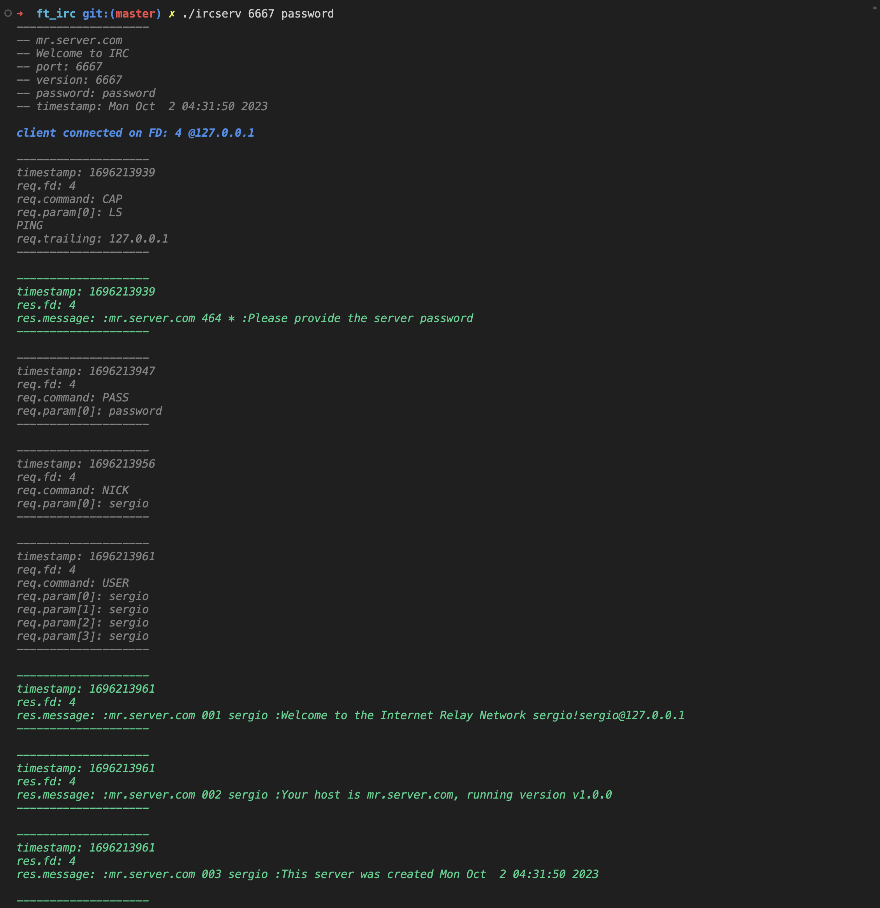
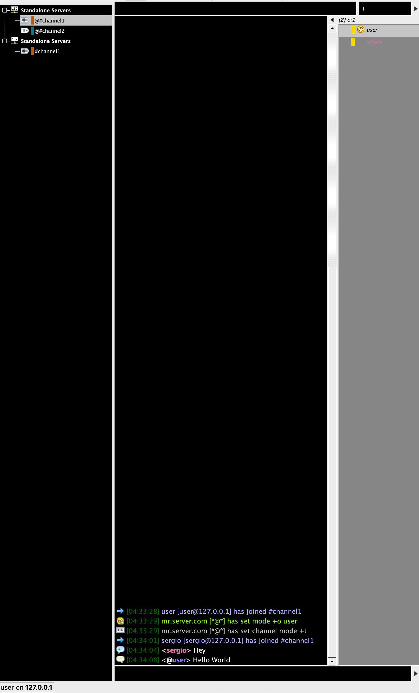

# FT_IRC - Creating an IRC Server

> ***The project was aimed at developing an Internet Relay Chat (IRC) server. The server is intended to work on a localhost. Being a text-based communication protocol, the IRC network allows for real-time direct messages as well as group messages within channels. This server facilitates these exchanges by allowing IRC clients to connect and interact in these channels***

## Approach
The server should meet requirements including handling multiple clients simultaneously without hanging, all I/O operations being non-blocking, usage of only a single poll function for handling operations, and support for a range of command operations. The project's approach involves achieving the following functionalities with programming in C++98:

1. **Server Handling:** Program the server to manage multiple clients simultaneously without hanging. Implement necessary checks to ensure the server never crashes or quits unexpectedly. 

2. **Non-Blocking Operations:** Ensure all I/O operations are non-blocking and use a single poll function to handle operations like read, write, listen, etc.

3. **Command Operations:** The server should be able to execute a range of command operations. For example, a user/client should be able to set username or nickname, join channels, send and receive private messages. 

4. **Channel Operators:** Implement specific channel operator commands like KICK, INVITE, TOPIC, & MODE along with their restrictions.

5. **Authentication:** The server must allow for user authentication.

6. **TCP/IP Communication:** The server must communicate with the client using TCP/IP(v4 or v6).

7. Some additional features include handling file transfer and supporting a bot.

The compiled server will be tested using an IRC client. It will be connected using the given port number and password.
Our server was tested with `KVIRC` IRC client program.

## Usage
To run the program you need to compile the source files using the provided Makefile and execute the resulting `ircserv` file:

Compile: `make`

Run: `./ircserv <port> <password>`

Your server is now listening for incoming connections on port `6667`.
To interact with the server, you will need an IRC client. For this project, we have tested the server using the `KVIRC` client program.

#### Run server with Valgrind && Docker

docker build -t irc .
docker run -p 6667:6667 irc

## IRC Commands
#### Some of the commands you can use with this server:

- Nick: To set a nickname, use the command: /nick your_nickname
- User: To set a username use the command: /user your_username
- Join: To join a channel, use the command in the format: /join #channel_name.

#### As a channel operator, you have additional commands available to you:

- Kick: To eject a user from a channel: /kick #channel_name username_to_kick
- Invite: To invite a user to a channel: /invite username_to_invite #channel_name
- Topic: To change or view the topic of the channel: /topic #channel_name new_topic
- Mode: To manage various channel privileges:
  - Set/remove Invite-only channel: /mode #channel_name +i/-i
  - Set/remove the restrictions of the TOPIC command to channel operators: /mode #channel_name +t/-t
  - Set/remove the channel key (password): /mode #channel_name +k key/-k
  - Give/take channel operator privilege: /mode #channel_name +o username/-o username
  - Set/remove the user limit to channel /mode #channel_name +l limit_number/-l

### Authors

<pre>
            Ft_IRC was created by <a href="https://github.com/Lacusch" target="_blank">lacush</a>, <a href="https://github.com/Sergi0Garcia" target="_blank">Sergi0Garcia</a>, and <a href="https://github.com/JideOgunlana" target="_blank">jide_O </a> as part of the 42 school curriculum.
    </section>
</pre>
